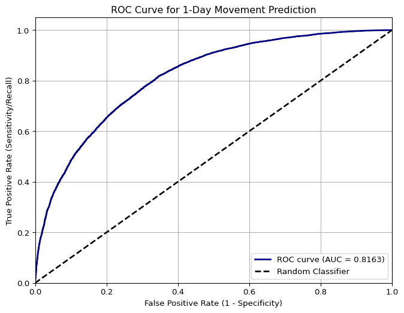

# Optimizing Stock Market Performance Using ML Ensemble Models


## Introduction

The outcome of this project is multi-fold, the goal is to predict if a
stock will go up or down in the future across different time horizons
and by what percent will the future stock price increase or decrease.
The success of the model will be determined by not only its ability to
correctly predict price movements but also its ability to act on them.
This will be done by the model acting as a hedge fund manager of a
financial firm trying to outperform the SP500 baseline.

## Code

``` python
import pandas as pd
import joblib
import pandas as pd 
import numpy as np   
from plotnine import *  
import xgboost as xgb 
from sklearn.model_selection import StratifiedShuffleSplit
from sklearn.impute import SimpleImputer
from sklearn.metrics import (
    accuracy_score, log_loss, roc_auc_score, confusion_matrix, classification_report, ConfusionMatrixDisplay, f1_score
)
from sklearn.model_selection import ParameterGrid
from tqdm import tqdm 
import matplotlib.pyplot as plt
import shap
from sklearn.metrics import roc_curve, roc_auc_score
from sklearn.preprocessing import StandardScaler
test = pd.read_feather("/Users/lukeromes/Desktop/Personal/Sp500Project/Data/TestData.feather")
transformed_data = test
binaryone = joblib.load("/Users/lukeromes/Desktop/Personal/Sp500Project/Models/FinalBoostedOneDayClassifier.joblib")
continuousone = joblib.load("/Users/lukeromes/Desktop/Personal/Sp500Project/Models/ContinuousOneDayFinal.job.lib")
```

### Preparing the Data for the One-Day Binary Classifier and running the model

``` python
import pandas as pd
import xgboost as xgb

drop_cols = ['Date', 'next_day_pct_change','Daily_Return',
 'next_5_day_pct_change',
 'Movement_5_day',
 'next_30_day_pct_change',
 'Movement_30_day',
 'Movement']

X = test.drop(drop_cols, axis = 1)
X_final = pd.get_dummies(X, drop_first=True)
actual = test['Movement'].astype(int)

dtest = xgb.DMatrix(X_final, label = actual)

pred = binaryone.predict(dtest)
pred_final = (pred >=.5).astype(int)

cm = confusion_matrix(actual, pred_final)
finalboostedcm = ConfusionMatrixDisplay(confusion_matrix=cm)
finalboostedcm.plot(cmap = "Blues")
plt.title("Final One Day Binary Confusion Matrix")
final_boosted_acc = accuracy_score(actual, pred_final)
print(f"Final Boosted Accuracy: {final_boosted_acc}")


pred_final_df = pd.DataFrame(pred_final)
pred_final_df = pred_final_df.reset_index().rename(columns={'index': 'iteration', 0: 'actual up/down'})
actual = actual.reset_index().rename(columns={'index': 'iteration'})
merged_binary = pd.merge(pred_final_df, actual, how='inner', on='iteration')
sorted_ticker_series = transformed_data['Ticker'].sort_values(ascending=True)
merged_binary['ticker'] = sorted_ticker_series.reset_index(drop=True)
merged_binary_one = merged_binary
plt.show()
```

    Final Boosted Accuracy: 0.7325354969574036


### Creating and Plotting ROC Curve

``` python
y_true_binary = test['Movement'].astype(int) 
probabilities = pred 
auc_score = roc_auc_score(y_true_binary, probabilities)
print(f"\nArea Under the Curve (AUC) for 1-Day Movement: {auc_score:.4f}")
fpr, tpr, thresholds = roc_curve(y_true_binary, probabilities)
plt.figure(figsize=(8, 6))

plt.plot(fpr, tpr, color='navy', lw=2, label=f'ROC curve (AUC = {auc_score:.4f})')

plt.plot([0, 1], [0, 1], color='black', lw=2, linestyle='--', label='Random Classifier')

plt.xlim([0.0, 1.0])
plt.ylim([0.0, 1.05])
plt.xlabel('False Positive Rate (1 - Specificity)')
plt.ylabel('True Positive Rate (Sensitivity/Recall)')
plt.title('ROC Curve for 1-Day Movement Prediction')
plt.legend(loc="lower right")
plt.grid(True)
plt.show()
```


    Area Under the Curve (AUC) for 1-Day Movement: 0.8163



### Preparing Data For Continuous Model and Running continuous model.

``` python
X = test.drop(['Date',
    'next_day_pct_change','next_5_day_pct_change',
    'Movement_5_day','next_30_day_pct_change',
    'Movement_30_day','Movement'
], axis=1)

if 'Date' in X.columns:
    X['Date'] = pd.to_datetime(X['Date']).view('int64')


X_raw = pd.get_dummies(X, drop_first=True)

required_features = continuousone.feature_names
X_final = X_raw.reindex(columns=required_features, fill_value=0)

X_final = X_final.apply(pd.to_numeric, errors='coerce').fillna(0)
y_final = test['next_day_pct_change'].astype(float)

dtest = xgb.DMatrix(X_final)
y_pred_one = continuousone.predict(dtest)
y_test_new = y_final.reset_index()
y_test_new = y_test_new.reset_index().drop('index', axis =1).rename(columns = {'level_0':'iteration', 'next_day_pct_change': 'actual'})
MAE_df = pd.DataFrame(y_pred_one).reset_index().rename(columns = {'index': 'iteration', 0 : 'Initial_Predicted'})
merged = pd.merge(y_test_new, MAE_df, how = 'inner', on = 'iteration')


merged['Initial_Predicted'] = merged['Initial_Predicted'] * 100 


sorted_ticker_series = transformed_data['Ticker'].sort_values(ascending=True)
merged['ticker'] = sorted_ticker_series.reset_index(drop=True)
merged_cont_one = merged 
```

### Continuous Model Results

``` python
squared_errors = (merged_cont_one ['actual'] - merged_cont_one ['Initial_Predicted']) ** 2

MSE = squared_errors.mean()
MSE_percent = MSE * 100

print(f"MSE: {MSE}")
print(f"MSE_percent: {MSE_percent}")


one_day_rmse = np.sqrt(MSE) 
one_day_rmse_percent = one_day_rmse * 100

print(f" one day rmse: {one_day_rmse}")
print(f"one day rmse percent: {one_day_rmse_percent}")

threshold = 0.5 
close_accuracy = np.mean(np.abs(merged_cont_one ['actual'] - merged_cont_one ['Initial_Predicted']) <= threshold)
print(f"Within ±0.5% accuracy (in percentage points): {close_accuracy}")
```

    MSE: 0.0009259250046423894
    MSE_percent: 0.09259250046423895
     one day rmse: 0.030429015834272218
    one day rmse percent: 3.0429015834272217
    Within ±0.5% accuracy (in percentage points): 0.98

The final objective that this model set out to accomplish was how well
it performs in a trading environment. In this study a simulated trading
environment was used with two different time periods, the testing period
as well as a range of future dates which the model had not been trained
nor previously been tested on. Testing dates for the simulation include
September third, 2025 through November 7th 2025 while the new data
includes November 11th, 2025 through November 26th, 2025.

The architecture powering this simulation is quite simple as each model,
the binary and continuous run and output results. A temporary table for
each model is created to hold the results along with a dummy variable
called “Buy” which is 1 if the model predicts future positive movement
and 0 if the model does not. These temporary tables are then subsetted
to only show instances where the buy column is equal to one and the two
tables, temporary binary and temporary continuous are merged on date and
ticker ensuring the final results are only stocks of which were
predicted to go up by both models. Next, the final merged table is
sorted based on predicted percent change and the top 10 stocks are
extracted and evenly bought from the initial \$100,000 starting capital.
This process then repeats for the remainder of the dates, but checks if
each day’s predictions align with current holdings. If the predictions
align with the current holdings, the model continues, if the current
holdings do not match the model predictions, the current holdings are
sold. The shares and selling price is extracted and added to a variable
called cash which is then used to invest in new securities.

### Trading Simulation Results vs SP500

``` python
model_perf = pd.read_csv("/Users/lukeromes/Desktop/Personal/Sp500Project/SP500Comparison/Result Data/modelovertime_future.csv")
removed_holdings = pd.read_csv("/Users/lukeromes/Desktop/Personal/Sp500Project/SP500Comparison/Result Data/removed_holdings_future.csv")
trade_log = pd.read_csv("/Users/lukeromes/Desktop/Personal/Sp500Project/SP500Comparison/Result Data/trade_log_df_future.csv")
sp_final = pd.read_csv("/Users/lukeromes/Desktop/Personal/Sp500Project/SP500Comparison/Result Data/sp500_final.csv")
sp_prices = pd.read_csv("/Users/lukeromes/Desktop/Personal/Sp500Project/SP500Comparison/Result Data/sp500closing.csv")
trade_log.loc[0, 'Cash_before'] = 100000
import numpy as np
future_merged = pd.merge(removed_holdings, trade_log, how= 'inner', left_on=['Stock', 'Shares_Owned'], right_on=['Ticker', 'Shares'])
future_merged = future_merged.drop('Unnamed: 0', axis = 1)
sp_prices['shares'] = 100000 / sp_prices['Close'].iloc[0]
sp_prices['value'] = np.nan
for i in range(0, len(sp_prices)):
    sp_prices['value'].iloc[i] = sp_prices['shares'].iloc[0] * sp_prices['Close'].iloc[i]


final_sp_future = sp_prices
final_sp_future['Date'] = pd.to_datetime(final_sp_future['Date'])
final_sp_future = final_sp_future[final_sp_future['Date'] >= '2025-11-12']
final_sp_future = final_sp_future[final_sp_future['Date'] <= '2025-11-26']
trade_log['Date'] = pd.to_datetime(trade_log['Date'])
from plotnine import *
future_price_comparisons_plot = (ggplot(trade_log, aes(x = 'Date', 
                                                        y = 'Cash_before'))+ geom_line()+ geom_line(final_sp_future, aes(x ='Date',y = 'value' ), color = 'red'))
trade_log['label'] = 'Model Trading'
final_sp_future['label'] = 'S&P 500 Baseline'

test_price_comparisons_plot = (
    ggplot() +
    geom_line(
        trade_log,
        aes(x='Date', y='Cash_before', color='label')
    ) +
    geom_line(
        final_sp_future,
        aes(x='Date', y='value', color='label')
    ) +
    scale_color_manual(values=['navy', 'dodgerblue']) +
    scale_x_datetime(date_breaks="3 days", date_labels="%Y-%m-%d") +
    labs(
        color='Legend',
        y='Value',
        title='Model Trading vs SP500 During Future Period'
    ) +
    theme(
        axis_text_x=element_text(rotation=45, hjust=1),
        figure_size=(12, 6)
    )
)

test_price_comparisons_plot
```


``` python
print(future_merged)
```

      Stock   Sell_Date  Sell_Price  Shares_Owned       Proceeds     sell_value  \
    0  GEHC  2025-11-13   73.699997   1085.481727   80000.000000   80000.000000   
    1  SOLV  2025-11-14   73.510002   1362.052423  100124.476529  100124.476529   
    2  AMAT  2025-11-18  223.761387    492.371724  110173.779582  110173.779582   
    3  AMCR  2025-11-19    8.440000  13053.766002  110173.779582  110173.779582   
    4  AMTM  2025-11-20   21.750000   5065.461130  110173.779582  110173.779582   
    5  GEHC  2025-11-21   73.129997   1506.547022  110173.779582  110173.779582   
    6    MU  2025-11-25  213.410004    538.668069  114957.154669  114957.154669   
    7  AMTM  2025-11-26   28.350000   4054.926036  114957.154669  114957.154669   

      Action_x        Date Ticker Action_y       Price        Shares  \
    0     Sell  2025-11-12   GEHC      BUY   73.699997   1085.481727   
    1     Sell  2025-11-13   SOLV      BUY   73.510002   1362.052423   
    2     Sell  2025-11-14   AMAT      BUY  203.351394    492.371724   
    3     Sell  2025-11-18   AMCR      BUY    8.440000  13053.766002   
    4     Sell  2025-11-19   AMTM      BUY   21.750000   5065.461130   
    5     Sell  2025-11-20   GEHC      BUY   73.129997   1506.547022   
    6     Sell  2025-11-21     MU      BUY  204.529999    538.668069   
    7     Sell  2025-11-25   AMTM      BUY   28.350000   4054.926036   

         Cash_before  
    0  100000.000000  
    1  100124.476529  
    2  100124.476529  
    3  110173.779582  
    4  110173.779582  
    5  110173.779582  
    6  110173.779582  
    7  114957.154669  

Simulation two consisting of unseen future dates not included in either
test nor train outperformed the SP500 as well. The model resulted in a
14.958% return compared to -0.29% return that the SP500 returned during
the same time period. During this simulation, the model purchases 18
securities and sells 9.
